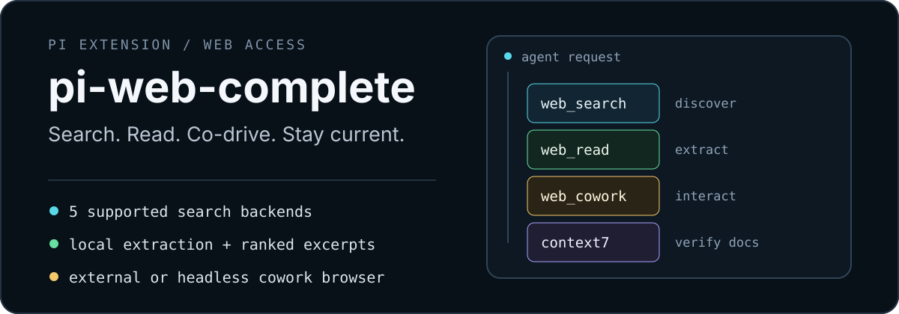
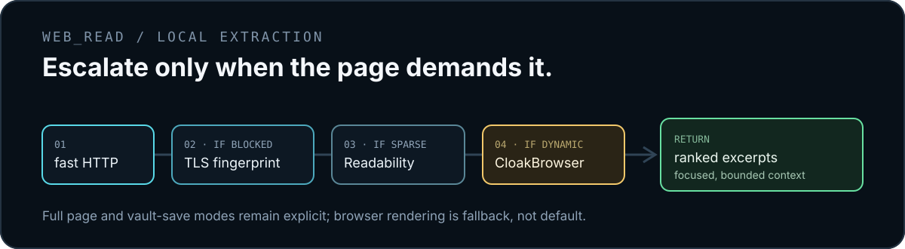

<p align="center">
  
</p>

# pi-web-complete

Give [Pi](https://github.com/badlogic/pi-mono) one extension for web discovery, clean local extraction, visible browser interaction, and version-current framework docs.

```bash
pi install npm:@itc-steve/pi-web-complete
```

## One extension, four jobs

| Tool | Use it for | What makes it useful |
| --- | --- | --- |
| **`web_search`** | Current facts and discovery | Brave, Serper, Tavily, Exa, and Linkup with shuffled fallback |
| **`web_read`** | Reading a URL | Local extraction with query-ranked excerpts by default; `web_fetch` alias included |
| **`web_cowork`** | Login, CAPTCHA, and multi-step pages | Visible CloakBrowser session shared by user and agent, optionally inside Herdr |
| **`context7`** | Library and framework APIs | Version-current documentation, registered only when configured |

`web_search` finds the page. `web_read` turns it into focused context. `web_cowork` handles pages that need a person or browser UI. `context7` keeps implementation work grounded in current docs.

## Quick start

### 1. Install

```bash
pi install npm:@itc-steve/pi-web-complete
```

From a local checkout:

```bash
pi install /path/to/pi-web-complete
```

### 2. Configure

Configuration and secrets live in separate files:

```bash
cp /path/to/pi-web-complete/web.json.example ~/.pi/agent/web.json
cp /path/to/pi-web-complete/web.env.example ~/.pi/agent/web.env
chmod 600 ~/.pi/agent/web.env
# edit web.json, then paste your keys into web.env
```

`~/.pi/agent/web.json`:

```json
{
  "defaultBackend": "auto",
  "backends": {
    "brave":  { "enabled": true, "apiKeyEnv": "BRAVE_API_KEY" },
    "serper": { "enabled": true, "apiKeyEnv": "SERPER_API_KEY" },
    "tavily": { "enabled": true, "apiKeyEnv": "TAVILY_API_KEY" },
    "exa":    { "enabled": true, "apiKeyEnv": "EXA_API_KEY" },
    "linkup": { "enabled": true, "apiKeyEnv": "LINKUP_API_KEY", "depth": "standard" }
  },
  "context7": { "enabled": true, "apiKeyEnv": "CONTEXT7_API_KEY" }
}
```

`~/.pi/agent/web.env`:

```bash
BRAVE_API_KEY=replace-with-brave-key
SERPER_API_KEY=replace-with-serper-key
TAVILY_API_KEY=replace-with-tavily-key
EXA_API_KEY=replace-with-exa-key
LINKUP_API_KEY=replace-with-linkup-key
CONTEXT7_API_KEY=replace-with-context7-key
GITHUB_TOKEN=replace-with-github-token
```

Project overrides can live in `.pi/web.json` and `.pi/web.env`. Project JSON overrides global top-level settings while `backends` merge per backend; project secrets overlay global secrets. Keep key values in `.env`, never JSON.

### 3. Use

```text
web_search({ query: "Node.js fetch timeout patterns", compact: true })
web_read({ url: "https://example.com/guide", query: "authentication setup" })
web_cowork({ action: "open", url: "https://example.com/login" })
context7({ library: "next.js", query: "app router middleware auth" })
```

## Read pages without flooding context

<p align="center">
  
</p>

`web_read` acquires the full page locally, then returns only the most relevant chunks for the query. Automatic mode escalates through fast HTTP, TLS-fingerprint fetch, alternate links, Readability, and CloakBrowser only when earlier paths are blocked or too sparse. It also follows short meta-refresh redirects up to five hops.

```text
web_read({ url, query: "HTTP caching Cache-Control" })
```

- Default: ranked excerpts with a roughly 6k-character budget.
- No query: compact page outline.
- `return: "full"`: complete main content, capped around 12k characters in chat.
- `savePath` or `saveDir`: full extract goes to disk; chat receives a short summary.
- `mode: "browser"`: force CloakBrowser rendering.
- GitHub issues and pull requests: clean bodies and comments through GitHub REST API; optional `GITHUB_TOKEN` or `GH_TOKEN` raises limits and enables private repositories.
- Metadata when available: author, publication date, site, and language.
- `maxBytes`: download cap with a 2 MB floor and 5 MB default; oversized bodies truncate instead of failing.

```text
web_read({ url, mode: "browser", saveDir: "~/vault/http-caching" })
```

URLs are restricted to HTTP(S). Requests to localhost, private IP ranges, and common internal or metadata hostnames are refused. This validation is hostname-level and does not resolve DNS.

## Search with fallback

Auto mode shuffles enabled backends that have resolvable keys. Empty results and provider failures move to the next backend; aborts stop immediately.

- Pin a provider with `backend: "brave"`, `"serper"`, `"tavily"`, `"exa"`, or `"linkup"`.
- Use `compact: true` for title-and-URL results while exploring.
- Limit `numResults` from 1 to 20.
- Set defaults in `web.json`.

Key resolution order for every `apiKeyEnv`:

1. `process.env[apiKeyEnv]`
2. `.pi/web.env`
3. `~/.pi/agent/web.env`
4. Legacy literal `apiKey` in JSON

Legacy JSON paths remain supported when the new paths are absent: `~/.pi/agent/extensions/search.json` and `.pi/search.json`.

## Work together in a visible browser

`web_cowork` keeps one headed CloakBrowser session open so the agent and user can share control. Use it for authentication, CAPTCHA, and stateful browser workflows; use `web_read` for one-shot extraction.

```text
web_cowork({ action: "open", url: "https://example.com/login" })
web_cowork({ action: "wait", message: "Log in, then continue" })
web_cowork({
  action: "batch",
  fills: [
    { ref: "@e3", text: "name@example.com" },
    { ref: "@e4", text: "hello" }
  ],
  clickRef: "@e5"
})
web_cowork({ action: "close" })
```

State-changing actions return fresh, bounded interactive refs. `snapshot` supports `interactive`, `content`, and `both` modes. Password and secret-looking values appear as `[redacted]`.

Persist sessions and choose a download directory with:

```json
{
  "cowork": {
    "userDataDir": "~/.cloakbrowser/cowork-profile",
    "downloadDir": "~/Downloads"
  }
}
```

Downloads default to `~/Downloads` and apply to cowork sessions and browser-rendered reads.

<details>
<summary><strong>Run CloakBrowser inside a Herdr pane</strong></summary>

Enable the opt-in [Herdr](https://herdr.dev) integration:

```json
{
  "cowork": {
    "herdr": { "enabled": true, "direction": "right" }
  }
}
```

| Setting | Default | Meaning |
| --- | --- | --- |
| `enabled` | `false` | Render inside Herdr instead of a desktop window |
| `direction` | `"right"` | Pane split direction |
| `focusOnOpen` | `true` | Focus browser pane when opened |
| `browserZoom` | `0.75` | Initial page zoom, from `0.5` to `2.5` |
| `showDiagnostics` | `false` | Show stream and viewport metrics |
| `captureScale` | `1` | Scale transferred frames from `0.1` to `1` |
| `screencastEveryNthFrame` | `1` | Use `2` to halve producer frame rate |
| `fallbackToWindow` | `true` | Open normal window when pane startup fails |
| `cdpPort` | `0` | Pick a free loopback port automatically |

Requirements:

1. Herdr 0.7.4+ with Pi running in a Herdr pane.
2. `kitty_graphics = true` under `[experimental]` in `~/.config/herdr/config.toml`.
3. `herdr server reload-config`, then restart the Herdr client. Clients attached before graphics were enabled can report a 0px cell size and drop every frame.
4. Ghostty, kitty, WezTerm, or another Kitty-graphics terminal.

When a requirement is missing, cowork reports why and opens a normal window. Set `fallbackToWindow: false` to make setup failure a hard error.

Verify setup:

```bash
npm run verify:herdr -- https://example.com
```

Add `--seconds 20` for timed exit or `--check` to validate without opening a pane. View errors go to `/tmp/pi-herdr-view.log`. Use `PI_HERDR_VIEW_RUNNER` to override the view runtime.

Pane controls:

| Input | Action |
| --- | --- |
| Click, drag, scroll, type | Forward input to page |
| `ctrl+l` | Edit URL; `Enter` navigates, `Esc` cancels |
| `ctrl+r`, `ctrl+t`, `ctrl+q` | Reload, new tab, close view |
| Toolbar row 1 | Select, close, or create tabs |
| Toolbar row 2 | Back, forward, reload, zoom, URL |

The view uses `bun` when available, otherwise packaged `tsx`. Pi retains its Playwright handle while a small pane process attaches over loopback CDP, streams backpressured screencast frames, and forwards input. Closing the pane does not kill the browser.

**Security:** Herdr mode exposes unauthenticated Chrome DevTools Protocol on loopback while cowork is open. Use it only on trusted, single-user hosts. User-driven navigation can reach local network services.

The pane view does not implement downloads, context menus, DevTools, IME, text selection, or find-in-page. Frame transport is tuned for local sessions, not remote SSH.

</details>

## Get current library docs

`context7` resolves a plain package name or accepts a Context7 library ID, then returns documentation ranked for the task. Get an API key at [context7.com/dashboard](https://context7.com/dashboard).

```text
context7({ library: "next.js", query: "app router middleware auth" })
context7({ library: "/vercel/next.js/v14.3.0", query: "server actions form validation" })
```

- Registered only when a Context7 key resolves.
- IDs can be version-pinned with `/v14.3.0` or `@v14.3.0`.
- Results are capped at 12k characters; narrow the query when truncated.
- `fast: true` skips LLM reranking for lower latency and lower relevance.
- Set `"enabled": false` to keep the key configured while hiding the tool.

## Tool reference

| Tool | Parameters |
| --- | --- |
| `web_search` | `query`, `numResults`, `backend`, `compact` |
| `web_read` / `web_fetch` | `url`, `query`, `return`, `mode`, `format`, `onlyMainContent`, `maxChars`, `maxBytes`, `headless`, `savePath`, `saveDir` |
| `web_cowork` | `action`, `url`, `mode`, `ref`, `role`, `name`, `selector`, `text`, `clear`, `fills`, `clickRef`, `key`, `deltaY`, `query`, `maxChars`, `message`, `timeoutMs` |
| `context7` | `library`, `query`, `fast` |

### Cowork actions

| Action | Purpose |
| --- | --- |
| `open`, `navigate` | Open or move the shared browser and return fresh refs |
| `wait` | Pause for user input, then return optional note and fresh refs |
| `snapshot` | Read interactive refs, content, or both |
| `click`, `type`, `press`, `scroll` | Act on the latest ref; role and name are fallbacks |
| `batch` | Fill 1–10 fields, then optionally click once |
| `status`, `close` | Inspect or end the session |

## Runtime behavior

- Node.js 20.18.1+ is required.
- `postinstall` runs `cloakbrowser install` and stores stealth Chromium under `~/.cloakbrowser/`.
- CloakBrowser checks for browser updates at launch. Tagged update logs are hidden because direct console output corrupts Pi's TUI; set `DEBUG=1` to show them or `CLOAKBROWSER_AUTO_UPDATE=false` to disable checks.
- Footer status remains empty until a service is used. Successful providers accumulate as a sorted service list; active reads and cowork sessions show brief progress.
- Set `"showStatus": false` to disable footer updates.
- Set `"read": { "headless": false }` or pass `headless: false` to show browser-rendered one-shot reads.

## License

[MIT](./LICENSE)

CloakBrowser's JavaScript wrapper is MIT-licensed. Its downloaded Chromium binary uses CloakBrowser's separate binary license; see its [LICENSE](https://github.com/CloakHQ/CloakBrowser/blob/main/LICENSE) and [BINARY-LICENSE.md](https://github.com/CloakHQ/CloakBrowser/blob/main/BINARY-LICENSE.md).
